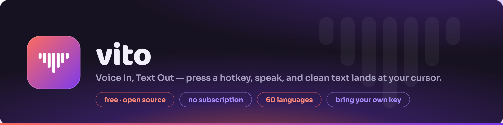
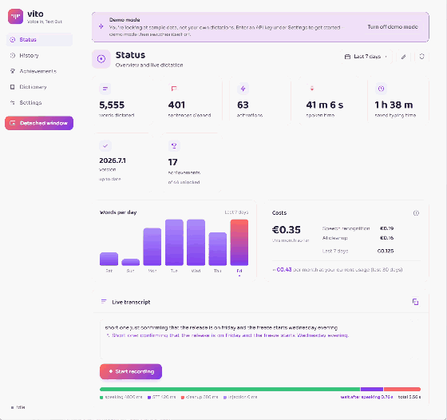
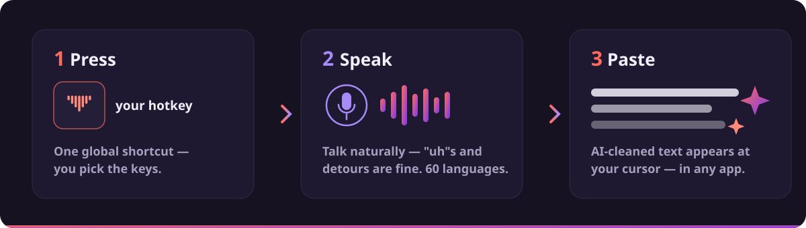
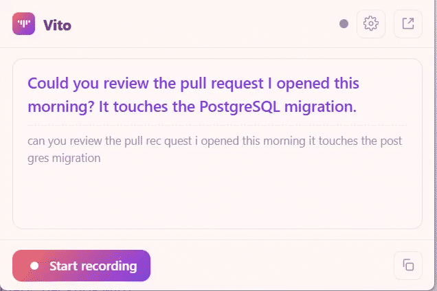
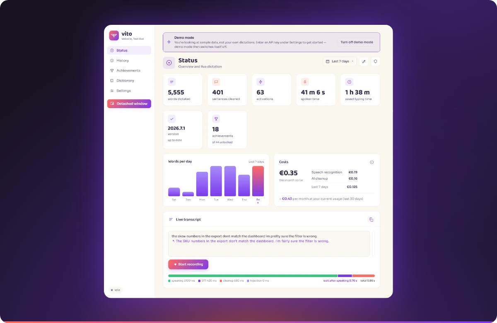

<p align="center">
  
</p>

<p align="center">
  <b>Press a hotkey. Speak. Clean text lands at your cursor — in any app.</b><br>
  A free, open-source, cross-platform voice-dictation tool. You bring your own API key; there's no subscription.
</p>

<p align="center">
  <a href="#download"></a>
  <a href="https://vito.talk"></a>
  <a href="https://ko-fi.com/vito_app"></a>
</p>

<p align="center">
  
  
  
  
</p>

---

## What is Vito?

**Vito** is short for **Voice In, Text Out**. It's a small background app that turns your voice into
polished, ready-to-use text — anywhere you can type. It comes with a friendly, built-in web interface to
manage everything — settings, history, dictionary and more — shown just below.

<p align="center">
  
</p>

You press a hotkey, speak naturally, and Vito:

1. **Transcribes** your speech with a best-in-class speech-to-text engine, then
2. **Cleans it up** with AI — stripping the "uhm"s and false starts, fixing punctuation, building proper sentences, and
3. **Pastes** the finished text straight at your cursor — in your editor, your browser, Slack, an email, anywhere.

No window to switch to, no copy-paste dance. Talk, and the text appears where you're already working.

<p align="center">
  
</p>

---

## Why Vito?

Dictation apps like [**Wispr Flow**](https://vito.talk/compare/wispr-flow/),
[**Superwhisper**](https://vito.talk/compare/superwhisper/),
[**Aqua Voice**](https://vito.talk/compare/aqua-voice/) and [**Willow**](https://vito.talk/compare/willow/)
are excellent — but most of them charge **a monthly subscription**, typically **€12–€30 a month**, whether
you use them a little or a lot. (Side-by-side [comparisons on vito.talk](https://vito.talk/compare/).)

Vito flips that model:

| | Subscription apps | **Vito** |
|---|---|---|
| **Cost** | Fixed €12–€30 / month | **Only the API you actually use** |
| **Idle months** | You still pay | **You pay nothing** |
| **Your key** | Locked to their backend | **Bring Your Own Key — your accounts** |
| **Source** | Closed | **Open source (AGPL-3.0)** |
| **Tracking** | Varies | **None. Zero telemetry.** |
| **Languages** | Varies | **60, UI translated into all 60** |

> **The app itself is free.** You only pay the speech-to-text and AI providers directly, for exactly what you
> dictate. Stop using it for a month and that month costs you **€0** — no recurring charge, ever.

---

## What does it cost to run?

Vito uses a **Bring Your Own Key (BYOK)** model.

<details open>
<summary><b>New to "Bring Your Own Key"? Here's what it means.</b></summary>

<br>

Instead of paying Vito, you create your own free account with the AI providers Vito uses, generate a
personal **API key** (a secret password that lets software use the service on your behalf), and paste it
into Vito once. From then on, Vito talks to those services **directly, using your account**, and you're
billed by them — pay-as-you-go, usually fractions of a cent per use.

Nothing runs through a middle-man server. It's *your* key, *your* account, *your* data, *your* bill.

</details>

<br>

Speech-to-text is billed **per hour of audio**. In practice that's about **15 cents (€0.15) for a solid hour
of continuous talking** — and almost nobody dictates non-stop.

| Your usage | Roughly costs |
|---|---|
| A busy hour of solid dictation | **~€0.15** |
| Normal daily use (email, notes, chat) | **a few euros / month** |
| **100 hours** of non-stop speech in one month | **~€15** |

To spend €15 in a month — a typical *monthly* subscription price elsewhere — you'd have to speak
**one hundred hours** without pausing. Even heavy, everyday users usually land at **just a few euros a month.**

> **Start free — no credit card.** Pair **[AssemblyAI](https://vito.talk/setup/assemblyai/)** (speech-to-text,
> free starting credit) with **[Groq](https://vito.talk/setup/groq/)** (AI cleanup, free tier) and you can set
> Vito up and start dictating without paying anything or entering a card.

---

## AI cleanup — from spoken to polished

Raw speech-to-text gives you a literal transcript. Vito adds an **AI cleanup pass** that turns it into text
you'd actually send:

- **Removes fillers** — "uh", "uhm", "you know", "I mean…", repeated words and false starts.
- **Fixes punctuation and capitalization**, and builds well-structured sentences.
- **Understands spoken commands** — say "new line" / "new paragraph" and it becomes real formatting.
- **Turns named emoji into emoji** — "thumbs up emoji" → 👍 — but only when you're clearly naming one.
- **Applies your dictionary** — names and jargon come out spelled the way you want.
- **Runs on the model you choose** — [Claude](https://www.anthropic.com), any **OpenAI-compatible** endpoint like [Groq](https://groq.com) (with a **free tier**), or a fully **local model** (Ollama, LM Studio) so the text never leaves your machine.

If cleanup ever errors or times out, Vito pastes the raw transcript instead — **a dictation is never lost.**
Both the raw and cleaned versions are kept in your history.

---

## Vito Assist — say "Vito, …" and it acts on your words

Beyond cleaning up, Vito can take a **spoken command**. Start a dictation with **"Vito, …"** and a short
instruction — it isn't typed out, it's carried out on your next dictation, or on the text already on your
clipboard:

- **Reshape** — *"Vito, translate to English"*, *"Vito, summarise this"*, *"Vito, turn this into bullet points"*.
- **Answer** — *"Vito, question"* then ask it, or *"Vito, reply to this"*.
- **Clipboard** — *"Vito, summarise the text on the clipboard"* — the result goes back to your clipboard, ready to paste.

It runs through the AI-cleanup pass, so it needs cleanup on — and you can point it at its own, heavier model
when you want. Usage gets its own statistics and achievements.

---

## 60 languages — speech *and* interface

Vito dictates in **60 languages**, and its entire interface is **translated into all 60** as well.

<details>
<summary><b>See all 60 languages</b></summary>

<br>

- **Western Europe (11):** English, Dutch, German, French, Spanish, Portuguese, Italian, Catalan, Galician, Basque, Welsh
- **Northern Europe / Baltic (7):** Danish, Swedish, Norwegian, Finnish, Estonian, Latvian, Lithuanian
- **Slavic (12):** Russian, Ukrainian, Belarusian, Polish, Czech, Slovak, Slovenian, Croatian, Serbian, Bosnian, Bulgarian, Macedonian
- **Rest of Europe / Turkic (7):** Greek, Romanian, Hungarian, Albanian, Turkish, Azerbaijani, Kazakh
- **Middle East (4):** Arabic, Hebrew, Persian, Urdu
- **South Asia (9):** Hindi, Bengali, Punjabi, Marathi, Gujarati, Tamil, Telugu, Kannada, Malayalam
- **East & Southeast Asia (8):** Chinese (Mandarin), Japanese, Korean, Vietnamese, Thai, Indonesian, Malay, Tagalog (Filipino)
- **Africa (2):** Swahili, Afrikaans

</details>

<br>

Together these cover roughly **75–80% of the world as a native language** — nearly every language with more
than 50 million speakers — and, counting people who use one of them as a second or lingua-franca language
(English, French, Arabic, Russian, Hindi, Spanish, Indonesian, Swahili…), **around 90%+ of humanity** can use
Vito in a language they understand.

---

## Privacy

- **No tracking. No telemetry. No analytics.** Vito never phones home.
- Your **history, statistics and settings stay on your own device.**
- The only thing that leaves your computer is the **audio you dictate**, sent **directly** to the
  speech-to-text provider, and — if cleanup is on — the **transcript**, sent directly to the AI provider.
  Nothing more, and only when you're actively dictating. Run cleanup on a **local model** and even the
  transcript never leaves your machine.
- Because it's **Bring Your Own Key**, that data flows through **your own accounts**, not ours. There is no
  Vito server in the middle.

### Providers Vito uses

| Purpose | Providers |
|---|---|
| **Speech-to-text** | [Soniox](https://soniox.com) · [AssemblyAI](https://www.assemblyai.com) |
| **AI cleanup** | [Anthropic](https://www.anthropic.com) (Claude), or any **OpenAI-compatible** endpoint — [Groq](https://groq.com) (free tier), [OpenAI](https://openai.com), or a **local model** (Ollama, LM Studio) that keeps cleanup fully on-device |

You only need a key for the speech-to-text provider to get started; the AI-cleanup key is optional but
recommended.

**Step-by-step setup guides**, one per provider:
[Soniox](https://vito.talk/setup/soniox/) · [AssemblyAI](https://vito.talk/setup/assemblyai/) ·
[Anthropic](https://vito.talk/setup/anthropic/) · [Groq](https://vito.talk/setup/groq/) (a free-tier option
for AI cleanup) — or browse [all setup guides on vito.talk](https://vito.talk/setup/).

---

## Features

Vito is **simple to use, but powerful under the hood.**

### Dictation & text
- 🎙️ **Press-to-talk or push-to-talk** — quick tap to toggle, or hold to talk and release to stop.
- ✨ **AI cleanup** of every dictation (fillers, punctuation, new lines, spoken emoji).
- 🪄 **[Vito Assist](https://vito.talk)** — say "Vito, …" with a command to translate, summarise, answer or reshape your dictation (or your clipboard), instead of typing it out.
- ⏸️ **Auto-stop on pause** — Vito can stop by itself when you stop speaking.
- 📋 **Paste, type or clipboard-only** injection modes for maximum app compatibility.
- 📁 **Upload an audio file** to have it transcribed to text.

### Interface
- 🌗 **Light & dark mode**, switching automatically with your OS preference.
- 🌍 **UI translated into 60 languages.**
- 🪟 **Mini always-on-top overlay** you can place anywhere on screen.

<p align="center">
  
</p>

- 🧪 **Built-in demo mode** with sample content, so a fresh install has something to show.

### Organize & improve
- 🔎 **Searchable history** of everything you've dictated.
- 📖 **Dictionary** for names, jargon and common mishearings — corrected automatically.
- 🔊 **Play back and save** your recordings.
- 🏆 **Achievements & gamification** to track milestones.
- 📊 **Detailed statistics** on usage and cost.

### System & maintenance
- 🚀 **Start with your computer**, so Vito is always ready.
- 🔁 **Backup & restore** with automatic rolling backups.
- ⬆️ **Built-in update checker** — tells you when a new version is out, and on Windows installs it for you.
- 🎧 **Configurable media behavior** while dictating — do nothing, duck the audio, or auto pause/play.
- 🐧 **Linux-friendly** — detects missing utilities/libraries and explains how to bind hotkeys in each desktop environment.

<p align="center">
  
</p>

---

## Download

> Vito is **cross-platform: Windows, Linux and macOS.**

- **Windows** — grab `Vito-Setup-<version>.exe` from the [**Releases**](../../releases) page. Per-user install,
  no admin needed.
- **Linux** — download the `Vito-<version>.AppImage` from [**Releases**](../../releases), make it executable,
  and run it. Nothing else to copy or install — the hotkey binds to a signal (see below).
- **macOS** — download `Vito-<version>.dmg` from [**Releases**](../../releases) and drag Vito to Applications.
  Universal (Apple Silicon and Intel), macOS 11 or newer. Vito lives in the menu bar, not the Dock.

  The build is **not signed with an Apple Developer certificate**. Double-clicking a freshly downloaded
  copy shows "Vito cannot be opened": use **right-click → Open**, and if macOS still refuses (it does on
  recent versions), go to **System Settings → Privacy & Security** and press **Open Anyway** under the
  message about Vito. You only do this once.

  Finder also shows a small ⌛ next to Vito's name. That is macOS reporting that the app has not been
  through notarisation — not that something is still copying, and not something approving the app clears.
  It is cosmetic: the ⌛ stays until the app is notarised, while Vito itself runs perfectly well.
  Then grant two permissions in **System Settings → Privacy & Security**:

  | Permission | Needed for | Without it |
  |---|---|---|
  | **Microphone** | recording your voice | Vito records silence |
  | **Accessibility** | the global hotkey, and pasting into other apps | no hotkey; injection falls back to an error, use *clipboard only* mode and paste yourself |

  You grant these once; updating Vito keeps them. (If you ever build Vito yourself without the signing
  certificate, macOS ties the grant to that exact binary instead, and every rebuild resets it — with the
  confusing symptom that the switch still shows as *on* while Vito reports the permission as missing.
  Select Vito in the list, remove it with **−**, and let Vito ask again.)

After installing, open Vito, paste in a speech-to-text API key, pick your hotkey, and start talking.

---

## Build from source

Vito is one Go binary with an embedded web UI — no GUI toolkit, no build step for the front end.
It uses cgo (miniaudio), so you build natively per platform with a C compiler available.

```sh
go build -o vito ./cmd/vito
```

<details>
<summary><b>Windows build details</b></summary>

<br>

cgo needs a C compiler (mingw-w64):

```powershell
winget install --id BrechtSanders.WinLibs.POSIX.UCRT   # mingw-w64, no admin
# open a fresh shell so gcc is on PATH, then from the repo root:
pwsh -File packaging/build-windows.ps1                  # -> vito.exe
```

To build the installer (calendar-versioned `year.month`):

```powershell
pwsh -File packaging/build-installer.ps1                # next free number this month
pwsh -File packaging/build-installer.ps1 -Version 2026.7.2 -Tag
```

</details>

<details>
<summary><b>Linux dependencies & setup</b></summary>

<br>

Runtime helpers (miniaudio dlopens ALSA/PulseAudio, so there's no link-time audio dependency):

- **PipeWire / PulseAudio** — audio capture/playback.
- **wl-clipboard** (`wl-copy`/`wl-paste`) — clipboard.
- **ydotool + ydotoold** — the synthetic Ctrl+V paste keystroke (works on GNOME/Mutter and niri).
- **libnotify** (`notify-send`) — state notifications.
- **pactl** / **playerctl** (optional) — duck/pause media while dictating.

```sh
sudo dnf install wl-clipboard ydotool libnotify pulseaudio-utils playerctl   # Fedora
```

Build the AppImage:

```sh
bash packaging/build-appimage.sh 2026.7                       # from Linux
pwsh -File packaging/build-appimage.ps1 -Version 2026.7       # from Windows, via Docker
```

The settings page checks for the helpers above and tells you what's missing, with per-desktop
instructions for binding the hotkey.

</details>

<details>
<summary><b>macOS build details</b></summary>

<br>

Nothing to install beyond the Xcode Command Line Tools — audio goes through CoreAudio and text injection
through CoreGraphics, both part of macOS, so there are no external helpers like Linux needs:

```sh
xcode-select --install
bash packaging/make-signing-cert.sh       # once per machine, see below
bash packaging/build-macos.sh 2026.8      # -> dist/Vito-2026.8.dmg
```

That produces a universal `Vito.app` (arm64 + x86_64, merged with `lipo`) inside a DMG, with a `.sha256`
beside it. Must run on macOS: cgo needs the real SDK, and the icon, signature and disk image are made with
Apple's own tools (`sips`, `iconutil`, `codesign`, `hdiutil`).

Two things the bundle carries that the binary alone cannot:

- **`NSMicrophoneUsageDescription`** in `Info.plist`. Without it macOS denies the microphone outright
  rather than asking, and dictation silently records nothing.
- **`LSUIElement`**, which keeps Vito out of the Dock and the app switcher — it lives in the menu bar,
  like the tray icon elsewhere.

`make-signing-cert.sh` creates a self-signed code-signing certificate in your login keychain, which the
build uses when it is there and falls back to ad-hoc when it isn't. It is worth the one command: macOS
stores a permission grant as a *code signing requirement*, and signed ad-hoc that requirement is the exact
binary — so every rebuild quietly invalidates the user's Accessibility approval. Signed with a certificate
that stays put, the requirement is `identifier … and certificate root …` and the grant survives updates.
Sign every release with the same certificate, and never commit it. The script also asks once for your
login keychain password, to add codesign to the key's partition list — without that macOS interrupts every
build with a password prompt, twice over, once per architecture of the universal binary.

It is still not a Developer ID and still not notarised, so the right-click-to-open step and the ⌛ remain.
Only an Apple Developer ID plus `notarytool` removes those.

</details>

<details>
<summary><b>Configuration & hotkeys</b></summary>

<br>

First run creates `~/.config/vito/config.json` (chmod 600) with defaults and an auth token. Configure
everything from the **web UI at `http://127.0.0.1:4573`** while the daemon runs — changes apply to the next
dictation without a restart.

On **Windows and macOS** you set the hotkey in the app itself, under Settings → Activation. On macOS it
needs the Accessibility permission; until you grant it the settings page shows the hotkey as denied and
says so.

**Wayland has no in-app global hotkeys by design** — bind a command to a key in your compositor. The
recommended commands send a signal to the running daemon, so they launch no process, need no binary path
(identical for AppImage, a package or a plain binary) and never wait for a squashfs mount:

- **GNOME / KDE:** Custom Shortcuts → command `pkill -USR2 -f 'vito serve'` (start/stop), and
  `pkill -USR1 -f 'vito serve'` (cancel).
- **niri** (`config.kdl`):
  ```kdl
  binds {
      Mod+D { spawn "pkill" "-USR2" "-f" "vito serve"; }
      Mod+Shift+D { spawn "pkill" "-USR1" "-f" "vito serve"; }
  }
  ```

`SIGUSR2` toggles a dictation, `SIGUSR1` cancels it (cleanup is the settings toggle, not a hotkey). On
**Windows and macOS** the daemon registers a global hotkey itself. The exact commands, per desktop, are also
shown in the app under Settings → Activation.

</details>

---

## Open source

Vito's full source is here for anyone to read, audit, and adapt.

It's released under the [**GNU Affero General Public License v3.0**](LICENSE). Use it, change it, build on it,
and yes — charge for it if you like. The AGPL asks one thing in return: if you distribute a changed version,
or run one as a service for other people, those people get the source too, under the same licence.
Improvements stay where everyone can reach them.

**Not open contribution.** Bug reports, ideas and translation corrections are very welcome; code contributions
are not accepted, so the copyright stays in one pair of hands and the licence can be changed later. Forking is
welcome and the licence guarantees it — see [CONTRIBUTING.md](CONTRIBUTING.md).

> The licence covers the code, **not** the name **Vito** or the waveform logo — a fork is welcome under a
> name and icon of its own.

---

## Support Vito

Vito is free and always will be. If it saves you a subscription — or just some typing — you can say thanks:

<p align="center">
  <a href="https://ko-fi.com/vito_app"></a>
</p>

---

<p align="center">
  <sub><b>Vito</b> — Voice In, Text Out · Speak anywhere, get clean text · Made with ❤️ and voice.</sub>
</p>
